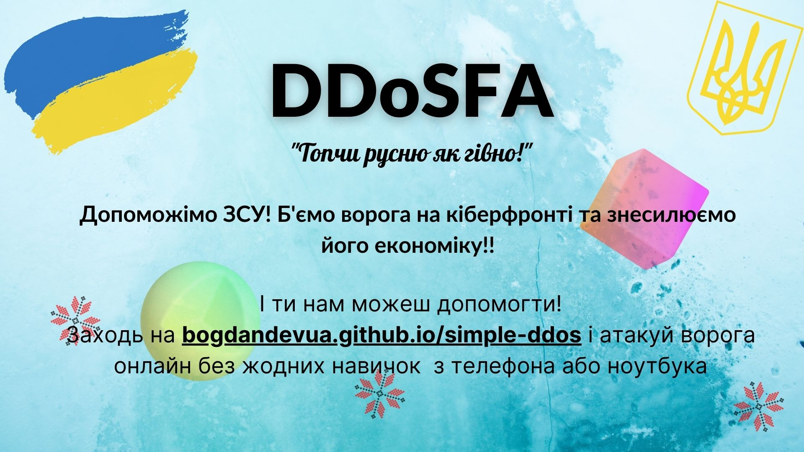

-   ### [Веб-сайт](https://bogdandevua.github.io/simple-ddos)

-   ### [Про війну](https://war.ukraine.ua)

-   ### [DDoS з кнопочного телефону (шок)](https://https://bogdandevua.github.io/simple-ddos/lite "Капєц")

---

Цей сайт створений для того, щоб всі могли дудосити русню, без жодних навичок, з будь якого пристрою онлайн, з будь якої точки світу

Якщо будуть питання - пишіть [розробнику в телеграм](https://t.me/dirim "Мій телеграм")

### Задонатити на **ЗСУ**

-   **monobank** - <https://uahelp.monobank.ua>
